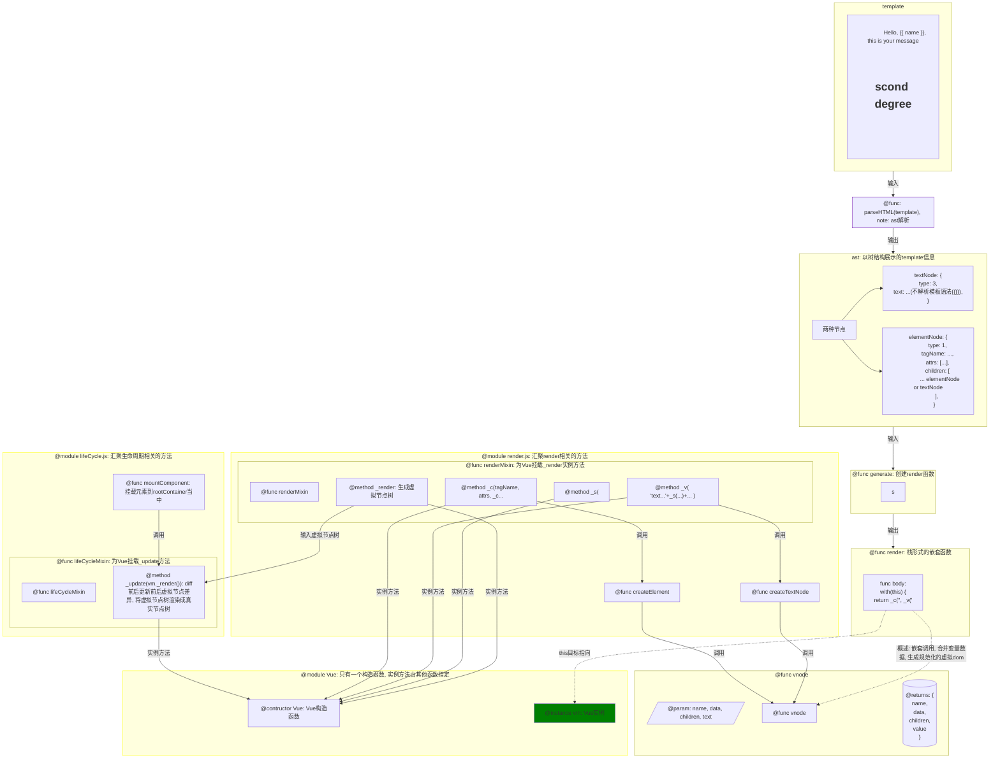

- [复习vue实现的知识](#复习vue实现的知识)
  - [1 实现虚拟dom](#1-实现虚拟dom)
    - [1.1 构建最简版虚拟dom - 设定目标](#11-构建最简版虚拟dom---设定目标)
    - [1.2 index.js (Vue实例)](#12-indexjs-vue实例)
    - [ast语法树解析](#ast语法树解析)


# 复习vue实现的知识

完整了了解了一遍vue源码的流程以后, 收下心来整理一遍

## 1 实现虚拟dom

前提, 拥有一个真实dom元素作为根元素容器
`<div id="app"></div>`

**输入情况(两种)** - 两种情况必须只有一个根元素包裹其他子元素

1. 真实dom元素 `<div>...</div>`
2. 模板 (**当前实现目标**)

template: string, 需要最外层只有一个元素节点, 为了更好地去处理, 也是对应了组合模式中
```JS
const template =  `<div class="todolist-wrapper">
    here is some text
    <ul class="todolist-container">
        <li class="done"></li>
        <li class="todo"></li>
        <li class="todo"></li>
    </ul>
    another text
</div>`
 ```

 template到render函数, 再到真实dom转换过程

 render函数: 

 ```JS
    const code = `_c({}, _v(), _c({}, _v()))`

    const render = new Function (`with (this) {
        return ${code}
    }`)

 ```
 
 相当于创建了这样一个函数:

 ```JS
    function render () {
        with(this) {
            return _c({}, _v(), _c({}, _v()))
        }
    }
 ```

 这个函数的作用?
 with (this) 中的this 是指向Vue实例的, with语句创建了一个作用域, 它内部`{}`的代码块的变量从对象this上面查找
 所以_c, _v函数都是调用vm._c, vm._v函数的. 同时, 如果它当中还有变量的话, 也会去vm上查找.
 
❓ 为什么不给ast创建with语句? 🤨 我觉得可能是 render函数是用于创建真实dom节点的

1. template -> ast
2. ast -> render
3. render -> vm
4. render, _c, _v -> dom
5. dom -> root container "#app"

待解决的问题

1. 如果将template转为ast?
2. _c, _v是什么, 它们的功能是什么呢?

### 1.1 构建最简版虚拟dom - 设定目标

根元素容器: `<div id="app"></div>`

**输入**

```JS
const app = new Vue({
    el: "#app",
    template: `
<div class="todolist-wrapper">
    <ul class="todolist-container">
        <li class="done"></li>
        <li class="todo"></li>
        <li class="todo"></li>
    </ul>
</div>
    `
})
```

**输出**

template当中的内容渲染到根元素容器当中

### 1.2 index.js (Vue实例)

`instance/index.js`
```JS
function Vue(options) {
  this._init(options)
}

initMixin(Vue)
```

通过initMixin(Vue)为Vue实例vm添加实例方法 `_init(options)`实例方法, 用于对vm进行初始化

```JS
export function initMixin(Vue) {
    Vue.prototype._init = function _init(options) {
        const vm = this

        vm.$options = options
        
        if (vm.$options.el) {
        vm.$mount(options)
        }
    }
}
```

现在问题来了 `_init` 方法主要做了什么事情?
目前主要做两件事情: 
1. 将options挂载到vm的属性 `$options` 上, 符号 `$` 代表这个属性是只读属性, 该属性代表了用户对实例的配置
2. 调用$mount方法(在init.js当中为Vue的挂载原型方法), 该方法做以下三件事情
   1. 通过 `el = document.querySelector('el')`将选择器转为dom节点对象
   2. 通过template创建render函数, 挂载到vm.$options.render上, **依赖于compile模块的compileToRenderFunction**
   3. 调用mountComponent函数(`lifecycle.js`当中定义的), mountComponent目的是将options中定义的template渲染成真实dom节点, 挂载到el当中
    


---

为什么要这么做? - 📑 **装饰器模式**
> 装饰器模式: 装饰器模式一种通过组合代替继承对对象行为进行拓展的方式, 能够在不改变原对象的基础上, 于程序运行期间动态地给对象添加职责(实例方法)

示例 - 分块给对象添加功能

```JS
const Wepon  =  function () {
}

const addFireDecorator = function () {
    Wepon.prototype = function () {
        console.log("发射子弹)
    }
}

const glassDecorator = function () {
    Wepon.prototype = function () {
        console.log("开始观察")
    }
}
```

---

### 1.3 ast语法树解析

第一个正则表达式, 匹配合法的标签名
1. 必须以字母开头
2. 可以包含数字, 单词, -, _

- div
- my-child
- DIV
- table_-Container
- column-1

cname 正则表达式
```JS
/
    [a-zA-Z] // 必须以字母开头
    [\w\d\-]* // 匹配单词字符和数字 
/
```
    
第2个正则表达式: 处理带参数的标签 比如 `<math: div>`对应 <arg: tagName>

第3个正则表达式: 匹配开始标签的左部

开始标签: `<div id="app" class="red">`
需要匹配的内容是: `<div `


### 1.4 将ast解析为render函数


### 1.5 为Vue实例添加_c, _v, _s方法

### 1.6 通过_c, _v, _s创建虚拟节点

虚拟节点

- name
    - 虚拟节点的名称
      - 如果是 _c() , 则对应其输入的节点名称
     
- data
    - 虚拟节点
- children

- text 

**vnode创建调用流程图**


